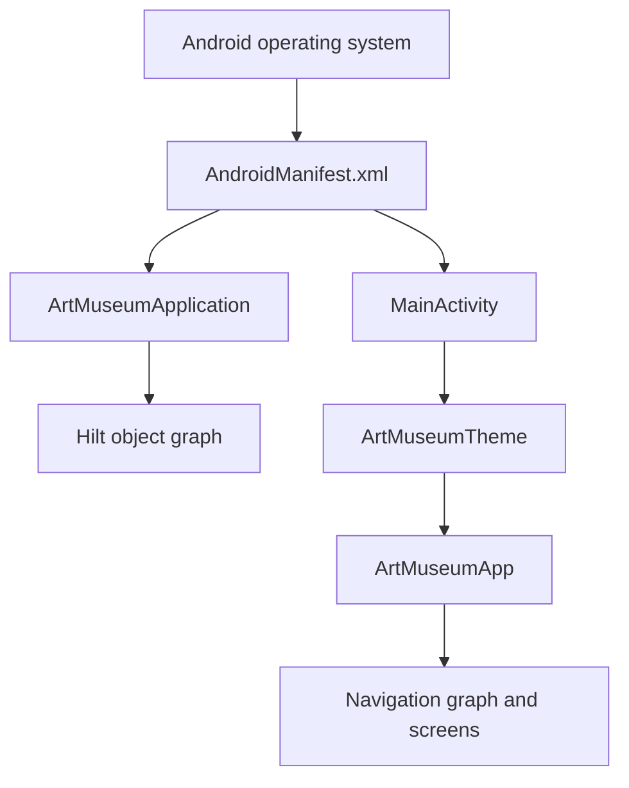

# Repository Overview and Tour

## Prerequisites

None. This is the best first document.

## What This Project Is

Art Museum Android App is a native Android client for the [ArtMuseum backend service](https://github.com/yeweijiehust/ArtMuseum). A **client** is software that asks another program, called a **server**, for data or actions. Here, the Android app is the client and the ArtMuseum service is the server.

The app lets anyone browse public artwork. Signed-in users can upload images and manage their own collection. It also caches gallery metadata so previously loaded artwork remains browsable if the network stops working.

Read [Programming, Web, and Android Foundations](../01-foundations/programming-web-android.md) if “client,” “server,” or “cache” is unfamiliar.

## Product Capabilities

| Capability | Who can use it? | Main implementation |
| --- | --- | --- |
| Browse public gallery | Everyone | `GalleryScreen`, `GalleryViewModel`, `GalleryRepositoryImpl` |
| View artwork detail | Everyone | `DetailScreen`, `DetailViewModel`, `getImage` |
| Register and log in | Signed-out users | `AuthScreen`, `AuthViewModel`, `AuthRepositoryImpl` |
| Upload artwork | Signed-in users | `UploadScreen`, `UploadViewModel`, `upload` |
| Browse personal museum | Signed-in users | `MineScreen`, `MineViewModel`, `refreshMine` |
| Edit or delete owned work | Signed-in owner | `EditScreen`, `EditViewModel`, `update` / `delete` |
| Change language | Everyone | `SettingsScreen`, `AppStrings`, `AppPreferences` |
| Change compatible server | Everyone | `SettingsScreen`, `EndpointRepositoryImpl` |

## Top-Level Directory Map

```text
ArtMuseumApp/
|-- .github/workflows/       GitHub Actions automation
|-- app/                     The one Android application module
|   |-- src/main/            Production code and resources
|   |-- src/test/            Tests that run on the development computer
|   |-- src/androidTest/     Tests that run on Android
|   `-- src/debug/           Debug-build-only configuration
|-- gradle/                  Dependency versions and Gradle wrapper files
|-- scripts/                 Developer automation
|-- tutorials/               The learning system you are reading
|-- build.gradle.kts         Root build plugin declarations
|-- settings.gradle.kts      Project/module/repository declarations
|-- constraints.md           Project development rules
`-- README.md                User- and contributor-facing project summary
```

A **module** is a buildable unit. This repository has one module, `app`. Packages inside it create architectural separation, but they are not independently compiled modules.

## Production Package Map

All production Kotlin lives under:

```text
app/src/main/java/com/yeweijiehust/artmuseum/
```

The main packages are:

- `domain`: business-shaped models, repository contracts, and validation rules;
- `data`: server, database, preference, cookie, and repository implementation code;
- `di`: Hilt instructions for constructing objects;
- `presentation`: Compose screens, navigation, localization, theme, and ViewModels.

This is a Clean Architecture-style dependency structure. Learn why in [Architecture and Data Flow](../03-architecture/architecture-and-data-flow.md).

## The Five Files to Read First

1. `domain/model/Models.kt`: the app’s core vocabulary.
2. `domain/repository/Repositories.kt`: the operations the app believes are possible.
3. `presentation/ArtMuseumApp.kt`: the screen map and protected navigation rules.
4. `presentation/viewmodel/ViewModels.kt`: user workflows and UI state.
5. `data/repository/RepositoryImplementations.kt`: coordination with server, cache, cookies, and preferences.

These files tell the business story. Framework-specific details live around them.

## How the App Starts



`AndroidManifest.xml` tells Android which application and activity classes to create. `ArtMuseumApplication` starts Hilt. `MainActivity` creates the Compose UI. `ArtMuseumApp` restores the session, provides localized text, and owns navigation.

The complete path is taught in [App Startup and Navigation](../05-walkthroughs/app-startup-and-navigation.md).

## Where Configuration Lives

- Default production endpoint: `AppPreferences.DEFAULT_ENDPOINT`
- Android identity and SDK levels: `app/build.gradle.kts`
- Internet permission and app entry points: `app/src/main/AndroidManifest.xml`
- Debug local-HTTP exceptions: `app/src/debug/res/xml/network_security_config_debug.xml`
- Release network policy: `app/src/main/res/xml/network_security_config.xml`
- CI checks: `.github/workflows/android-ci.yml`

## Important Boundaries

The app deliberately distinguishes several similar-looking things:

- A `MuseumImage` is the app’s business model.
- An `ImageDto` is the JSON/network representation.
- An `ImageEntity` is the Room/database representation.
- A `GalleryUiState` is what one screen needs to render.

Keeping these separate makes server, storage, and screen changes less likely to damage one another. This distinction is central to [Architecture and Data Flow](../03-architecture/architecture-and-data-flow.md).

## First Hands-On Exercise

1. Run `.\gradlew.bat assembleDebug`.
2. Open `Models.kt` and identify the fields of an artwork.
3. Open `GalleryScreens.kt` and find where `image.title` is displayed.
4. Open `RepositoryImplementations.kt` and find where the public image list is requested.
5. Draw the path from server JSON to visible title.

You can compare your drawing with [Gallery Refresh, Pagination, and Offline Detail](../05-walkthroughs/gallery-and-offline.md).
