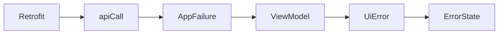

# Asynchronous and Reactive Programming

## Prerequisites

- [Programming, Web, and Android Foundations](programming-web-android.md)
- [Kotlin From Zero](kotlin-from-zero.md)

## Why Asynchronous Work Exists

Network requests and disk access take time. If the app blocked Android’s main UI thread while waiting, animations and taps would freeze. Asynchronous programming lets the app begin slow work and keep the UI responsive.

## Coroutines

A **coroutine** is a lightweight unit of asynchronous work. It can pause without blocking its underlying thread and resume later.

```kotlin
viewModelScope.launch {
    repository.refreshPublic()
}
```

- `viewModelScope` is a lifecycle-aware coroutine scope owned by a ViewModel.
- `launch` starts a coroutine.
- Work is cancelled when the ViewModel is permanently cleared.

## Suspending Functions

```kotlin
suspend fun refreshPublic(): GalleryPage
```

`suspend` means the function may pause and resume. It can only be called from another suspending function or a coroutine. It does not automatically create a background thread; it marks a function that cooperates with Kotlin’s coroutine system.

Retrofit and Room provide suspending APIs in this repository. A repository can call them sequentially while the coroutine machinery handles waiting.

## Streams and `Flow`

A `Flow<T>` is an asynchronous stream of values of type `T`.

```kotlin
fun observePublicImages(): Flow<List<MuseumImage>>
```

This is not one gallery result. It is a stream that can emit a new list whenever the Room database changes.

Why a stream is useful:

1. the repository writes refreshed images to Room;
2. Room emits a new list;
3. the ViewModel receives it;
4. Compose renders it.

The UI does not need a manual “database changed” callback.

## `StateFlow`

A `StateFlow<T>` is a Flow that always has a current value. It is well suited to UI state.

```kotlin
private val operationState = MutableStateFlow(GalleryUiState())
```

- `MutableStateFlow` can be updated by the owning class.
- `StateFlow` exposes observable state to readers.
- `.value` reads or replaces the current state.

The code usually replaces immutable state with `copy`:

```kotlin
operationState.value =
    operationState.value.copy(refreshing = true, error = null)
```

This preserves all fields except those explicitly changed.

## Combining State Sources

Gallery state comes from two places:

- image content emitted by Room;
- transient operation state such as loading, cursor, and error.

```kotlin
combine(repository.observePublicImages(), operationState) { images, operation ->
    operation.copy(images = images)
}
```

`combine` emits whenever either source changes. This separation lets cached images remain visible while a network refresh fails.

`stateIn` turns the combined Flow into a `StateFlow`:

```kotlin
.stateIn(
    viewModelScope,
    SharingStarted.WhileSubscribed(5_000),
    GalleryUiState()
)
```

It collects while the UI is subscribed, waits five seconds before stopping, and has an initial state.

## Collecting in Compose

```kotlin
val state by viewModel.state.collectAsStateWithLifecycle()
```

This converts a Flow into Compose state while respecting Android lifecycle. When the value changes, Compose recomposes functions that read it.

`by` is Kotlin property delegation syntax. Here, it lets code use `state` instead of `state.value`.

## Side Effects

Composable functions should mainly describe UI. Work that must happen because of a state or key change goes in an effect:

```kotlin
LaunchedEffect(state.success) {
    if (state.success) onSuccess()
}
```

When `state.success` changes, Compose launches the effect. Upload and authentication screens use this to navigate after successful work.

The gallery uses a more advanced effect:

```kotlin
snapshotFlow { nearEndOfGrid }
    .distinctUntilChanged()
    .filter { it }
    .collect { viewModel.loadMore() }
```

`snapshotFlow` turns reads of Compose state into a Flow. It emits when the user scrolls near the end. `distinctUntilChanged` avoids duplicate adjacent values, and `filter { it }` keeps only `true`.

## Cancellation and Duplicate Work

Some actions guard against repeated submission:

```kotlin
if (state.value.submitting) return
```

The gallery also refuses pagination if no cursor exists or a load is already running. These are small state-machine rules that prevent duplicate requests.

## Error Propagation

A suspending function can throw an exception. Repository exceptions travel up to the ViewModel:



The ViewModel catches the failure through `runCatching`, maps it with `toUiError`, and publishes new UI state.

## Alternative Approaches

- Callbacks can represent asynchronous results, but deeply nested callbacks are harder to compose.
- RxJava provides streams and operators similar to Flow, but Kotlin Flow integrates naturally with coroutines.
- A screen could call repositories directly, but ViewModels preserve state across configuration changes and keep UI code focused on rendering.

## Next

You now have the prerequisites for [Art Museum Domain](../02-domain/art-museum-domain.md) and [Architecture and Data Flow](../03-architecture/architecture-and-data-flow.md).
