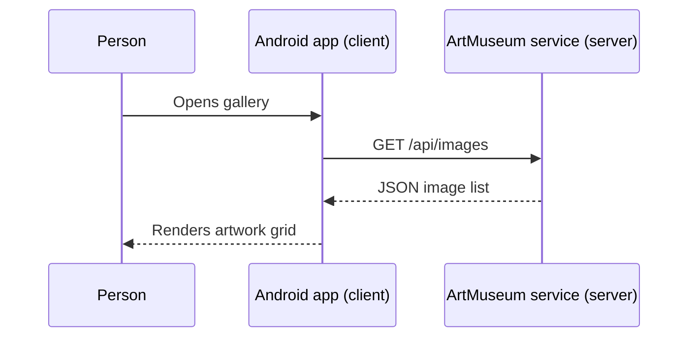

# Programming, Web, and Android Foundations

## Why This Lesson Exists

This repository combines several worlds: a program running on a phone, a remote server, local databases, and a reactive UI. This lesson establishes the concepts needed before reading the implementation.

## Programs, Values, and Functions

A **program** is a sequence of instructions executed by a computer. A **value** is data such as a title, email address, or image byte count. A **variable** gives a value a name. A **function** groups instructions behind a name and may accept input and return output.

For example, `Validators.title(value)` accepts text and returns `true` or `false`. Its business purpose is to prevent empty or overlong artwork titles.

Objects group related values and behavior. In this app, a `MuseumImage` object holds artwork metadata, while a `GalleryRepositoryImpl` object performs gallery operations.

## Client and Server

The Android app and the backend are separate programs:



The app cannot directly read the server’s database. It sends an HTTP request through the server’s public API.

## HTTP and URLs

**HTTP** is a request-response protocol used by web clients and servers. A URL identifies where to send a request.

The default base URL is:

```text
https://artmuseum-w9mm.onrender.com
```

The gallery path is:

```text
/api/images
```

Together they form:

```text
https://artmuseum-w9mm.onrender.com/api/images
```

Common HTTP methods in this app:

- `GET`: read data;
- `POST`: create something or perform an action;
- `PATCH`: update part of an existing item;
- `DELETE`: remove something.

HTTP responses include a **status code**. `200` means success, `401` means authentication is required, `404` means missing, and `500`-range responses indicate server failures. [API, JSON, and Authentication](../02-domain/api-json-auth.md) connects these concepts to every route.

## JSON

JSON is a text format for structured data. A simplified artwork might look like:

```json
{
  "id": "abc123",
  "title": "Morning Light",
  "width": 1200,
  "description": null
}
```

An object uses braces. Property names are strings. Values can be text, numbers, booleans, lists, nested objects, or `null`. `null` means “no value.”

The app converts JSON into typed Kotlin objects such as `ImageDto`. That process is called **deserialization**. The reverse is **serialization**.

## Authentication and Authorization

**Authentication** answers “Who are you?” Login authenticates a person.

**Authorization** answers “Are you allowed to do this?” A signed-in user may edit their own artwork but not another user’s artwork.

The server sends an `am_session` cookie after successful login. A cookie is a small value that the client sends back with later requests. This app persists that cookie so a session can survive an app restart.

## Local and Remote Data

**Remote data** lives on the server and requires a network request.

**Local data** lives on the phone:

- Room stores cached artwork metadata in `artmuseum.db`;
- DataStore stores endpoint, language, and cookie preferences;
- Coil maintains image memory and disk caches.

A **cache** is a local copy used for speed or resilience. It is not necessarily the source of truth. The server remains authoritative for uploads, edits, and deletes.

## Android Application Basics

Android is an operating system. An Android app is packaged as an APK and runs inside a controlled process.

Important concepts in this repository:

- `Application`: process-wide initialization; `ArtMuseumApplication` starts Hilt.
- `Activity`: a top-level Android UI host; `MainActivity` hosts Compose.
- `Manifest`: XML that declares app identity, permissions, and entry points.
- `Resource`: non-code data such as icons, colors, and XML configuration.
- `Context`: access to Android system and app services.
- Lifecycle: the app and its screens can start, stop, and be recreated.

Jetpack Compose is the UI toolkit. Instead of manually changing visual widgets, the app describes what the UI should look like for the current state. Learn that model in [Compose, State, and Navigation](../04-frameworks/compose-state-navigation.md).

## Android Source Sets

A **source set** is code or configuration included for a particular purpose:

- `src/main`: every build;
- `src/debug`: only debug builds;
- `src/test`: local JVM tests;
- `src/androidTest`: tests installed and run on Android.

This matters for security. Main network configuration forbids cleartext HTTP. Debug configuration permits HTTP only for local development hosts.

## Build Systems and Dependencies

Source code often relies on reusable external libraries called **dependencies**. Gradle is the build system that downloads dependencies, compiles code, runs tests, and packages the APK.

The Gradle wrapper scripts (`gradlew` and `gradlew.bat`) select a consistent Gradle version. Learn the project’s build setup in [Dependencies and Build System](../reference/dependencies-and-build.md).

## Next

Read [Kotlin From Zero](kotlin-from-zero.md) to learn how these ideas are expressed in code.
