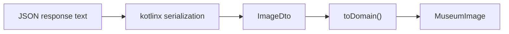
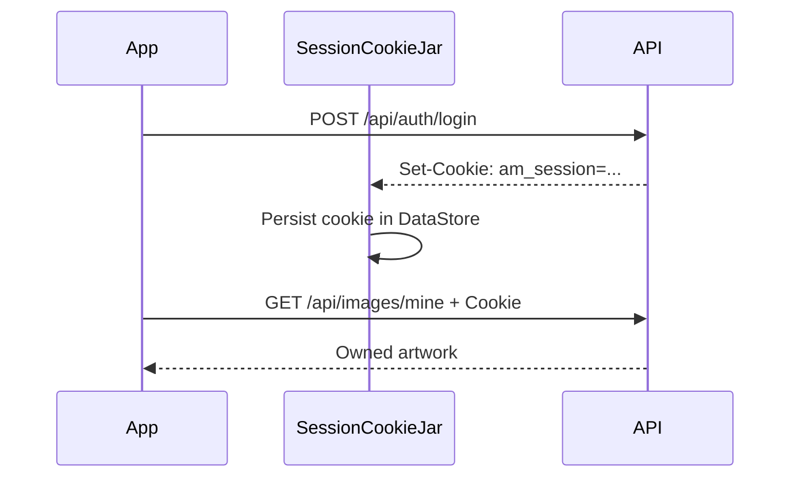

# API, JSON, and Authentication

## Prerequisites

- [Programming, Web, and Android Foundations](../01-foundations/programming-web-android.md)
- [Art Museum Domain](art-museum-domain.md)
- [Kotlin From Zero](../01-foundations/kotlin-from-zero.md)

## What an API Contract Is

An API contract defines which requests a client may send and which responses it can expect. The server publishes an OpenAPI document at `/api/docs/json`. The app’s `ArtMuseumApi` interface and DTOs are a typed client interpretation of that contract.

## Route Map

| Method and path | Purpose | Authentication |
| --- | --- | --- |
| `GET /api/health` | Confirm compatible service | No |
| `POST /api/auth/register` | Create account and session | No |
| `POST /api/auth/login` | Create session | No |
| `GET /api/auth/me` | Read current account | Yes |
| `POST /api/auth/logout` | End session | Yes |
| `GET /api/images` | Public paginated gallery | No |
| `GET /api/images/{id}` | One artwork | No |
| `GET /api/images/mine` | Current user’s artwork | Yes |
| `POST /api/images` | Upload artwork | Yes |
| `PATCH /api/images/{id}` | Update metadata | Owner |
| `DELETE /api/images/{id}` | Delete artwork | Owner |

`{id}` is a path parameter: a placeholder replaced by an artwork ID.

## DTOs and Deserialization

A DTO, or **Data Transfer Object**, mirrors data transferred over the network. `ImageDto` uses `Double` for numeric fields because that matches the observed JSON contract. `toDomain()` converts them to the integer types preferred by the app.



Why not use `MuseumImage` directly for JSON? Separating representations protects domain code from transport-specific changes and allows explicit conversion.

`@Serializable` instructs the Kotlin serialization plugin to generate a serializer. `Json { ignoreUnknownKeys = true }` allows the server to add fields without breaking older clients.

## Retrofit Interface Syntax

```kotlin
@POST
suspend fun login(
    @Url url: String,
    @Body body: LoginRequestDto
): Response<AuthResponseDto>
```

- `@POST` selects the HTTP method.
- `suspend` makes the request awaitable from a coroutine.
- `@Url` supplies the full runtime URL.
- `@Body` serializes the DTO as JSON.
- `Response<AuthResponseDto>` includes status, headers, and a possible typed body.

The app uses absolute URLs because the base endpoint can change at runtime. Retrofit still requires a base URL during construction, but each call’s `@Url` overrides it.

## Successful and Failed Responses

`apiCall` centralizes response handling:

1. call the Retrofit function;
2. translate network and serialization exceptions;
3. return the body for successful responses;
4. parse JSON error bodies for failed responses;
5. map status/code into an `AppFailure`.

An API error body has this shape:

```json
{
  "error": {
    "code": "INVALID_CREDENTIALS",
    "message": "Invalid email or password"
  }
}
```

The stable `code` drives app behavior. Human-facing text comes from the app’s bilingual strings rather than displaying the server’s message directly.

## Status Codes and Error Codes

Status codes provide broad categories, while API codes provide precise meaning.

For example, both an expired session and wrong password may use HTTP `401`, but:

- `UNAUTHORIZED` becomes `AppFailure.Unauthorized`;
- `INVALID_CREDENTIALS` remains an API failure and becomes `UiError.InvalidCredentials`.

That distinction lets the app show “Email or password is incorrect” instead of the misleading “Your session has expired.”

## Cookie Authentication

On successful login or registration, the server returns an `am_session` cookie.



OkHttp asks `SessionCookieJar` which cookies belong on each request. The cookie’s domain, path, and expiration rules determine whether it matches.

Security implications:

- release traffic requires HTTPS;
- session cookies are removed on logout, unauthorized protected requests, endpoint changes, or expiration;
- the app never treats the in-memory `User` alone as proof of authorization.

## Multipart Upload

JSON is a poor fit for large binary image bytes. The upload route uses `multipart/form-data`, which sends separate named parts:

- `file`: binary image body;
- `title`: text;
- `description`: text;
- `altText`: text.

`GalleryRepositoryImpl.upload` converts bytes into an OkHttp `RequestBody`, creates a `MultipartBody.Part`, and sends all fields through Retrofit.

## URL Encoding for Cursors

Cursors may contain characters with special meanings in URLs. `URLEncoder.encode` transforms them into safe query-parameter text before constructing the pagination URL.

## Contract Testing

The live contract script downloads real JSON without mutating production:

- health;
- first gallery page;
- first image detail;
- OpenAPI;
- unauthorized `/api/auth/me` error.

`LiveContractDeserializationTest` parses those fixtures with production serializers. This catches drift between server JSON and client DTOs.

Learn how to run and interpret it in [Testing and Continuous Integration](../06-quality/testing-and-ci.md).

## Alternatives

- Token headers could replace cookies. Cookies match the backend contract and let OkHttp manage request attachment.
- GraphQL could replace route-oriented REST, but the service exposes REST/OpenAPI.
- Manual JSON parsing would remove code generation but create repetitive, error-prone parsing.
- Relative Retrofit paths would be simpler for one fixed endpoint, but runtime endpoint replacement requires absolute URLs.

## Next

Read [Architecture and Data Flow](../03-architecture/architecture-and-data-flow.md) to see how the network boundary fits the whole app.
