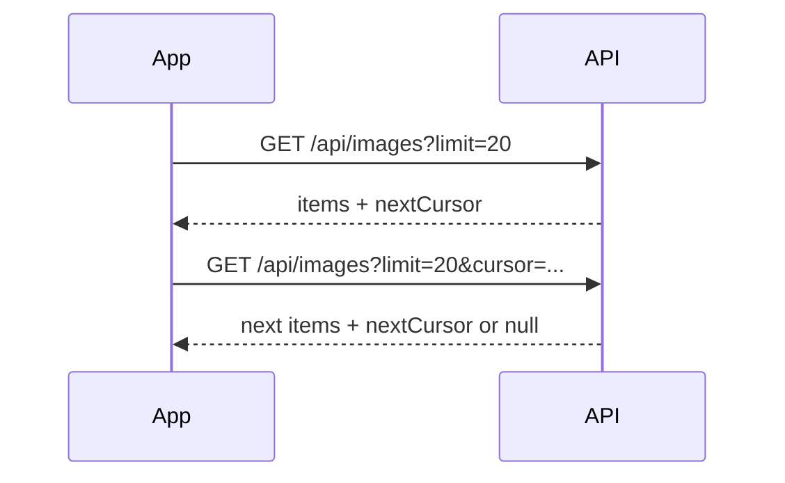

# Art Museum Domain

## Prerequisites

- [Programming, Web, and Android Foundations](../01-foundations/programming-web-android.md)
- [Repository Tour](../00-orientation/repository-tour.md)

A **domain** is the real-world problem area a program models. The domain here is a public digital art museum with personal collections.

## Artwork

The central business object is an artwork image. In code it is `MuseumImage` in `domain/model/Models.kt`.

| Field | Domain meaning |
| --- | --- |
| `id` | Stable identity used in routes, cache, edit, and delete |
| `ownerId` | Identity of the account that owns the work |
| `ownerDisplayName` | Public name shown beside the work |
| `url` | Remote image location loaded by Coil |
| `width`, `height` | Pixel dimensions used for display and details |
| `format` | Image format such as JPEG, PNG, or WebP |
| `bytes` | File size |
| `title` | Required human-readable name |
| `description` | Optional explanation |
| `altText` | Optional accessibility description |
| `createdAt`, `updatedAt` | Server-provided timestamps |

Why one model contains both image facts and museum metadata: a gallery card needs title, owner, URL, and dimensions together. A detail screen needs the remaining metadata.

## Public Gallery and Personal Museum

The same artwork can appear in two ordered collections:

- the **public gallery**, visible to everyone;
- the owner’s **personal museum**, visible after authentication.

The Room entity contains `publicPosition` and `minePosition`. A non-null position means the artwork belongs in that cached list. One row can therefore participate in both lists without duplicating the artwork metadata.

This cache design is explained in [Persistence, Cache, and Images](../04-frameworks/persistence-cache-images.md).

## Ownership

Ownership controls mutation. A user can browse public content without signing in, but upload, personal collection, edit, and delete are protected operations.

There are two enforcement layers:

1. The app redirects signed-out users away from protected screens.
2. The server authoritatively checks whether the authenticated user may perform the action.

The first improves experience. The second provides security. Client-side checks alone are never sufficient because a modified client could bypass them.

## Accounts and Sessions

`User` is the signed-in account identity. The app keeps the current user in the in-memory `SessionStore`. The authentication cookie is persisted separately in DataStore.

The distinction matters:

- cookie: proof sent to the server;
- `User`: convenient account data rendered by the app;
- session restoration: call `/api/auth/me` using the saved cookie to reconstruct `User`.

See [Login, Session Restoration, and Protected Routes](../05-walkthroughs/authentication.md).

## Upload Input

`UploadInput` contains:

- raw image `ByteArray`;
- original file name;
- MIME type;
- title, description, and alt text.

A **MIME type** is a standardized content label such as `image/jpeg`. The app accepts JPEG, PNG, and WebP up to 10 MiB.

The app validates input before upload to provide immediate feedback and avoid needless network use. The server must validate again because it cannot trust clients.

## Validation Rules

`Validators` implements client-side versions of API boundaries:

| Value | Rule |
| --- | --- |
| Email | 3–254 characters, with basic `@` and domain-dot checks |
| Password | 8–128 characters |
| Display name | 2–80 trimmed characters |
| Title | 1–120 trimmed characters |
| Description | At most 1000 characters |
| Alt text | At most 300 characters |
| Image | Accepted MIME type and 1 byte through 10 MiB |

These are UX guards, not security guarantees.

## Pagination and Cursors

The public gallery is fetched in pages. `GalleryPage` contains items and an optional `nextCursor`.

A **cursor** is an opaque server-provided continuation token. “Opaque” means the client should store and return it without interpreting its internal format.



When `nextCursor` is `null`, there is no known next page. `GalleryViewModel.loadMore` guards that condition.

## Offline Browsing

Offline behavior is intentionally read-only:

- public and personal gallery metadata remains in Room;
- detail loading falls back to Room only for network failures;
- Coil may show cached image bytes;
- mutations are not queued.

This is a product decision. Offline mutation queues require conflict resolution, retries, user feedback, and durable operation state. See [Design Decisions and Alternatives](../07-extension/design-decisions.md).

## Endpoint Compatibility

Users may point the app at another compatible ArtMuseum deployment. The app does not trust an arbitrary URL immediately. It requests `/api/health` and requires:

```json
{
  "ok": true,
  "service": "artmuseum-api"
}
```

Changing servers clears cookie, in-memory user, and database content so accounts and artwork from one deployment do not leak into another.

## Failures as Domain-Relevant Outcomes

`AppFailure` turns infrastructure details into meaningful categories:

- network: offline, timeout, unreachable;
- HTTP/service: unavailable, rate-limited, unauthorized, forbidden, not found;
- contract: invalid response;
- business/API: invalid credentials, duplicate email, invalid file, and similar codes;
- configuration: invalid endpoint.

The presentation layer maps these to `UiError` and bilingual recovery prompts.

## Where the Domain Is Implemented

- Models and failures: `domain/model/Models.kt`
- Repository contracts: `domain/repository/Repositories.kt`
- Validation rules: `domain/validation/Validators.kt`
- Workflow coordination: `presentation/viewmodel/ViewModels.kt`
- Actual data operations: `data/repository/RepositoryImplementations.kt`

## Next

Read [API, JSON, and Authentication](api-json-auth.md) to learn how these concepts cross the network.
