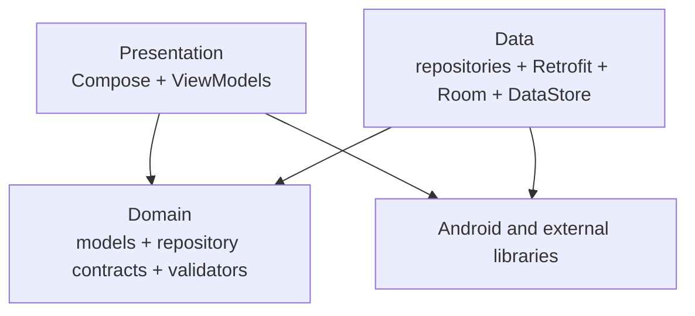
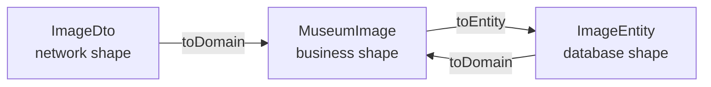
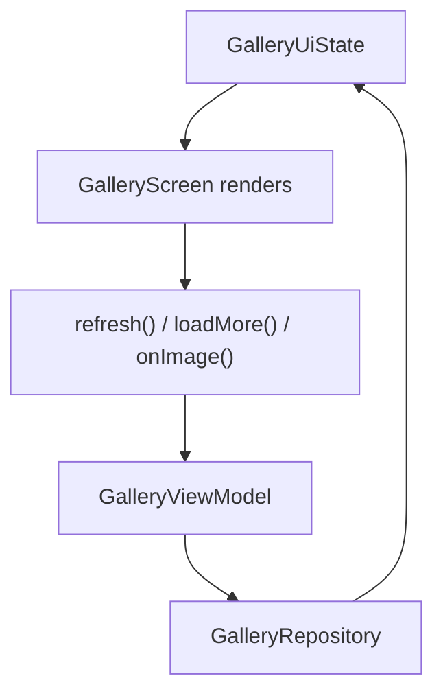
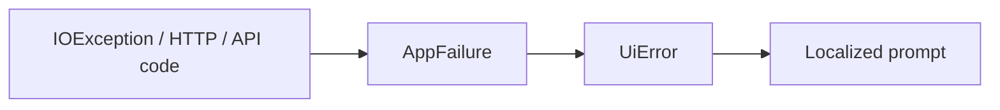

# Architecture and Data Flow

## Prerequisites

- [Kotlin From Zero](../01-foundations/kotlin-from-zero.md)
- [Asynchronous and Reactive Programming](../01-foundations/async-and-reactive.md)
- [Art Museum Domain](../02-domain/art-museum-domain.md)

## What Software Architecture Means

Software architecture is the high-level organization of responsibilities and dependencies. Good architecture makes expected changes local and unexpected interactions easier to detect.

This app uses a Clean Architecture-style package layout inside one Gradle module.

## Layers

### Domain

The domain layer describes business concepts and capabilities without choosing UI, network, or storage frameworks.

- `MuseumImage`, `User`, `GalleryPage`
- `AppFailure`
- repository interfaces
- validation rules

### Data

The data layer implements domain repository contracts. It knows how to talk to the API, cache records in Room, persist preferences, manage cookies, and map representations.

### Presentation

The presentation layer turns user events into repository calls and results into UI state. ViewModels coordinate behavior. Compose screens render state and send events.

### Dependency Injection

The `di` package is assembly code. It tells Hilt which concrete objects satisfy abstract dependencies.

## Dependency Direction

The most important rule is that stable business contracts should not depend on volatile technical details.

`GalleryRepository` does not mention Retrofit, Room, or Compose. Therefore:

- ViewModels can request gallery behavior without knowing storage details;
- data implementation can coordinate multiple sources;
- tests can replace production implementation with a fake.

This is the **Dependency Inversion Principle**, one of SOLID’s principles.

## SOLID in This Repository

- **Single Responsibility**: `SessionCookieJar` manages cookies; `Validators` validates inputs; `ImageDao` defines database access.
- **Open/Closed**: a new repository implementation can satisfy an existing interface without changing ViewModels.
- **Liskov Substitution**: a fake `GalleryRepository` can replace the real one in ViewModel tests.
- **Interface Segregation**: endpoint, preferences, auth, and gallery contracts are separate rather than one enormous repository.
- **Dependency Inversion**: ViewModels depend on domain interfaces, not data implementations.

The project is pragmatic rather than doctrinaire. It has no explicit use-case classes; ViewModels call repository contracts directly.

## Representation Boundaries

Three artwork representations serve three different concerns:

Why this matters:

- API numbers can be `Double` while business dimensions are `Int`;
- Room can store list positions that do not belong in the domain model;
- UI and business code do not depend on serialization or Room annotations.

## One-Way UI Data Flow

State moves down to the UI; events move up:

This pattern is often called **unidirectional data flow**. It makes rendering predictable because the screen is a function of current state.

## State Machines

Even without a formal state-machine library, each UI state data class defines possible situations.

For the gallery:

- initial: empty images and `refreshing = true`;
- content: non-empty images;
- content plus pagination: `loadingMore = true`;
- cached content plus refresh failure: images remain, `error != null`;
- empty failure: no images and `error != null`;
- end reached: `nextCursor = null`.

Branch order in `GalleryScreen` determines what the user sees for each combination.

## Source of Truth

For gallery lists, Room acts as the observable local source of truth:

1. repository downloads data;
2. repository writes Room in a transaction;
3. Room emits the new list;
4. ViewModel combines it with operation state;
5. Compose redraws.

The network response still provides pagination cursor metadata, but list content reaches the UI through Room.

## Transactions

A database transaction groups related writes atomically: either the whole group succeeds or it is rolled back. `refreshPublic` clears old public positions and writes the new page inside `withTransaction`. Without a transaction, observers might briefly see an empty or half-written gallery.

## Typed Failure Pipeline

Each layer uses the vocabulary it needs:

- data maps technical failures;
- domain-style `AppFailure` categorizes outcomes;
- presentation maps them to UI choices;
- localization supplies language-specific text.

## Why No Use-Case Classes?

Classic Clean Architecture often adds one class per action, such as `RefreshGalleryUseCase`. This repository calls repository methods directly because workflows are small and mostly one operation.

Adding use cases becomes valuable when:

- an action combines several repositories;
- authorization or policy must be reused;
- orchestration grows complex;
- the same action is triggered from multiple presentation surfaces.

## Next

- [Packages and Responsibilities](package-map.md) maps every file.
- [Dependency Injection with Hilt](dependency-injection.md) explains runtime assembly.
- The [real execution walkthroughs](../README.md#stage-5-real-execution-and-code-walkthroughs) apply this architecture to actual user actions.
