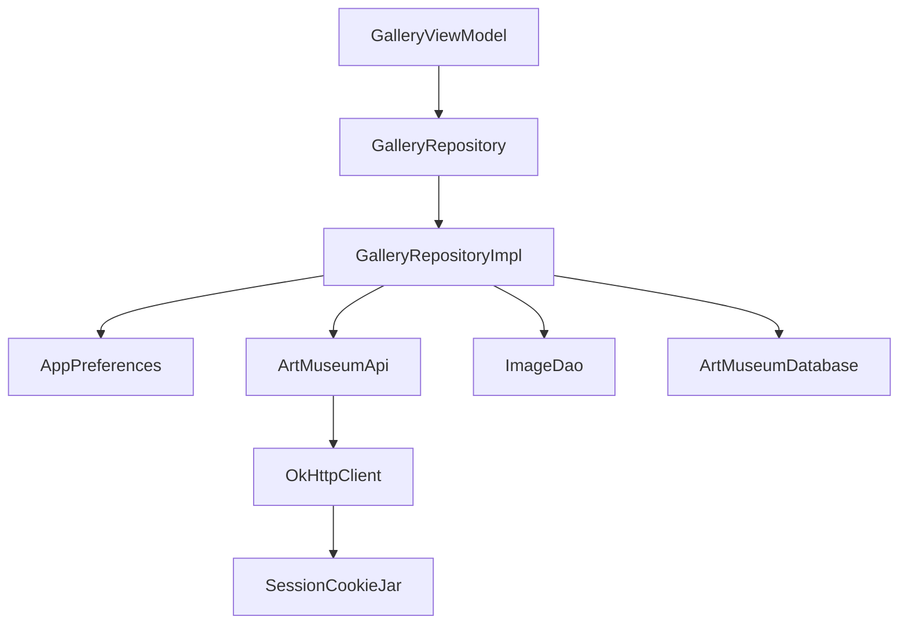

# Dependency Injection with Hilt

## Prerequisites

- [Kotlin From Zero](../01-foundations/kotlin-from-zero.md)
- [Architecture and Data Flow](architecture-and-data-flow.md)

## The Construction Problem

`GalleryViewModel` needs a `GalleryRepository`. The production repository needs preferences, API, JSON parser, DAO, database, cookie jar, and session store. Those objects need still more objects.

Manually constructing everything in each screen would duplicate setup and tightly couple classes to concrete implementations.

**Dependency injection** means an object receives what it needs from outside instead of constructing dependencies itself.

## Constructor Injection

```kotlin
class GalleryViewModel @Inject constructor(
    private val repository: GalleryRepository
) : ViewModel()
```

The ViewModel declares its need but does not choose how to satisfy it. `@Inject` tells Hilt this constructor may be used.

Benefits:

- dependencies are visible in the constructor;
- production and tests can provide different implementations;
- object lifetimes are centrally managed.

## Hilt’s Object Graph

An **object graph** is the network of constructed objects and their dependencies.



`ArtMuseumApplication` carries `@HiltAndroidApp`, which starts generation of the application graph. `MainActivity` carries `@AndroidEntryPoint`, allowing Hilt-backed Android and Compose integration. ViewModels carry `@HiltViewModel`.

## Providing Constructed Objects

Some objects come from builders rather than injectable constructors. `AppModule` uses `@Provides`:

```kotlin
@Provides
@Singleton
fun database(@ApplicationContext context: Context): ArtMuseumDatabase =
    Room.databaseBuilder(context, ArtMuseumDatabase::class.java, "artmuseum.db").build()
```

Read this as: “When the graph needs an `ArtMuseumDatabase`, call this function using application context, and reuse one instance.”

`@ApplicationContext` distinguishes the process-wide Android context from other possible context values.

## Binding Interfaces

Hilt cannot infer which implementation should satisfy an interface. `RepositoryModule` uses `@Binds`:

```kotlin
@Binds
@Singleton
abstract fun gallery(impl: GalleryRepositoryImpl): GalleryRepository
```

Read it as: “Whenever something asks for `GalleryRepository`, provide the singleton `GalleryRepositoryImpl`.”

`@Binds` is efficient for a direct interface-to-implementation mapping. `@Provides` is used when creation requires custom code.

## Scope and Lifetime

`@Singleton` means one instance for the application graph.

Singleton is appropriate for:

- Room database;
- Retrofit and OkHttp;
- repository implementations;
- preferences;
- session store and cookie jar.

These objects coordinate shared process-wide state or are expensive to create.

ViewModels have a navigation/lifecycle-related lifetime rather than application lifetime. `hiltViewModel()` obtains the correct instance for the current navigation destination.

## Why Hilt Matters to Tests

Local ViewModel tests bypass Hilt and directly pass fake repositories:

```kotlin
val repository = FakeGalleryRepository(...)
val viewModel = GalleryViewModel(repository)
```

This works because constructor injection keeps the class independently constructible.

## Alternatives

- Manual dependency injection can be excellent for small projects but requires explicit assembly code.
- A service locator lets classes request global dependencies, but hides requirements and complicates tests.
- Other DI frameworks such as Koin use runtime lookup; Hilt uses Dagger’s generated compile-time graph.

## When Adding a Dependency

1. Decide whether the object belongs to a framework module or has an injectable constructor.
2. Prefer constructor injection for your own classes.
3. Use `@Provides` for builders/external objects.
4. Use `@Binds` for interface-to-implementation mapping.
5. Select the narrowest appropriate lifetime.
6. Verify the dependency direction still follows [Architecture and Data Flow](architecture-and-data-flow.md).
