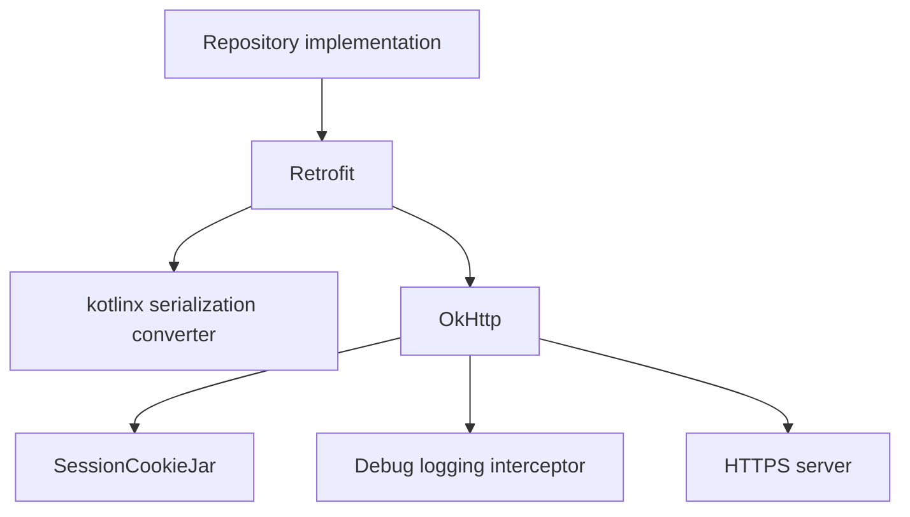

# Networking and Serialization

## Prerequisites

- [API, JSON, and Authentication](../02-domain/api-json-auth.md)
- [Asynchronous and Reactive Programming](../01-foundations/async-and-reactive.md)
- [Dependency Injection with Hilt](../03-architecture/dependency-injection.md)

## The Networking Stack

The app uses three cooperating libraries:



- Retrofit turns annotated Kotlin functions into HTTP calls.
- OkHttp performs the actual HTTP transport, headers, cookies, and connections.
- kotlinx serialization converts between JSON and DTOs.

## Retrofit Construction

`AppModule.api` builds one Retrofit instance:

```kotlin
Retrofit.Builder()
    .baseUrl(AppPreferences.DEFAULT_ENDPOINT)
    .client(client)
    .addConverterFactory(json.asConverterFactory("application/json".toMediaType()))
    .build()
    .create(ArtMuseumApi::class.java)
```

The converter factory says that `application/json` bodies should use the configured `Json` instance. `create` generates an implementation of the `ArtMuseumApi` interface.

Although Retrofit requires a base URL, every API method takes `@Url`, allowing the current endpoint from DataStore to override it.

## OkHttp and Interceptors

`OkHttpClient.Builder().cookieJar(cookieJar)` delegates cookie persistence and attachment to `SessionCookieJar`.

In debug builds, `HttpLoggingInterceptor.Level.BASIC` logs request/response lines without dumping full bodies. Logging is omitted from release builds to reduce noise and avoid exposing sensitive details.

`BuildConfig.DEBUG` is a build-generated boolean indicating the current build type.

## Serialization Configuration

```kotlin
Json { ignoreUnknownKeys = true }
```

This accepts new server fields that the current DTO does not declare. It still fails when required declared fields are absent or have incompatible types, which helps detect breaking contract changes.

Nullable DTO properties such as `description: String?` explicitly accept JSON `null`.

## Central API Call Handling

Without `apiCall`, every repository method would repeat:

- `try` / `catch`;
- successful status checking;
- body presence checking;
- error-body parsing;
- status mapping.

The generic helper preserves response type:

```kotlin
suspend fun <T : Any> apiCall(
    json: Json,
    block: suspend () -> Response<T>
): T
```

The `block` parameter is a suspending lambda. A repository supplies a specific call:

```kotlin
apiCall(json) { api.image(url("/api/images/$id")) }
```

The compiler infers `T` as `ImageDto`.

`apiCallUnit` separately handles successful responses with no meaningful body, such as delete and logout.

## Failure Mapping

### Transport Failures

`mapNetworkFailure` classifies Java I/O exceptions:

- `SocketTimeoutException` → timeout;
- unknown host, connection failure, no route → unreachable;
- other `IOException` → offline.

These categories are imperfect observations of a complex network, but they lead to better recovery prompts.

### HTTP and API Failures

`parseError` reads the error body once and tries to decode `ApiErrorBodyDto`. `runCatching` prevents malformed error JSON from hiding the original HTTP status.

`mapApiFailure` prioritizes known API codes, then falls back to status-based categories.

## Absolute Endpoint URLs

Repository methods read the current endpoint:

```kotlin
private suspend fun url(path: String) =
    "${preferences.endpoint.first()}$path"
```

`first()` suspends until the Flow emits one value, then stops collecting. This makes each request use the currently persisted endpoint.

Trade-off: string URL construction is simple but must preserve correct slashes and encoding. Endpoint normalization removes trailing slashes, and cursor values are URL-encoded.

## Network Security Configuration

Release/main config denies cleartext HTTP. Debug config permits HTTP only for:

- `localhost`;
- `127.0.0.1`;
- `10.0.2.2`, the Android emulator alias for the host computer.

`EndpointRepositoryImpl.normalizeEndpoint` enforces the same policy before a URL is saved. Defense in depth means both app logic and Android network policy agree.

## Cookie Persistence Caveat

`SessionCookieJar` calls blocking DataStore access through `runBlocking` because OkHttp’s `CookieJar` methods are synchronous. This keeps the adapter simple, but blocking should remain small and infrequent. A more advanced design could maintain a memory cache and persist asynchronously.

## Debugging Network Calls

For debug builds:

1. inspect Logcat for basic OkHttp request/response lines;
2. run the live contract script to separate server-contract issues from UI issues;
3. verify endpoint and HTTPS/local-host rules;
4. inspect error mapping before changing prompts.

See [Debugging Guide](../06-quality/debugging.md) for symptom-based steps.
