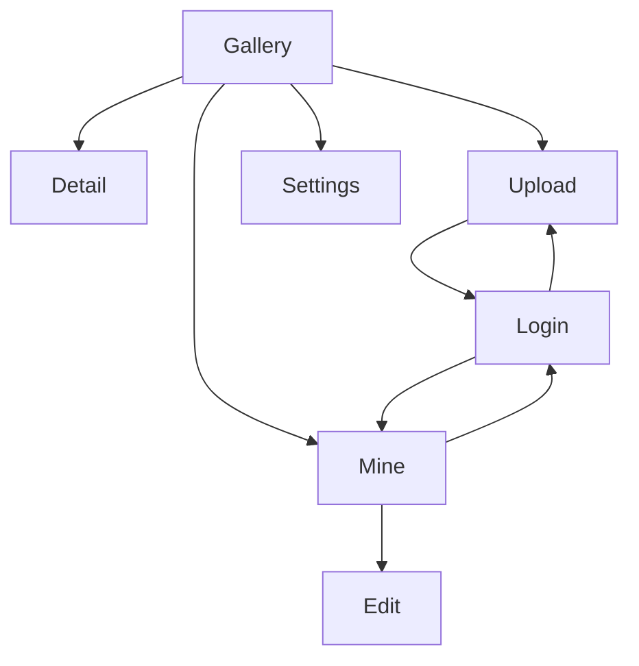

# Walkthrough: App Startup and Navigation

## Prerequisites

- [Packages and Responsibilities](../03-architecture/package-map.md)
- [Dependency Injection with Hilt](../03-architecture/dependency-injection.md)
- [Compose, State, and Navigation](../04-frameworks/compose-state-navigation.md)

This walkthrough traces a real launch from Android process creation to the first gallery screen.

## 1. Android Reads the Manifest

`app/src/main/AndroidManifest.xml` declares:

- Internet permission;
- `.ArtMuseumApplication`;
- `.MainActivity` as an exported launcher activity;
- main network security configuration;
- app icon, label, theme, and backup rules.

The launcher intent filter tells Android that `MainActivity` is the entry shown from the home screen.

## 2. Android Creates the Application

`ArtMuseumApplication` extends Android `Application` and carries `@HiltAndroidApp`.

Business purpose: initialize process-wide services before screens need them.

Implementation effect: Hilt generates a base application and singleton dependency graph containing preferences, JSON, OkHttp, Retrofit, Room, repositories, and session state.

## 3. Android Creates `MainActivity`

`MainActivity.onCreate`:

1. calls the parent implementation;
2. enables edge-to-edge drawing;
3. calls `setContent`;
4. wraps the app in `ArtMuseumTheme`;
5. invokes `ArtMuseumApp`.

`setContent` changes the activity from an imperative view host into a Compose host.

## 4. Hilt Creates `AppViewModel`

`ArtMuseumApp(viewModel: AppViewModel = hiltViewModel())` asks Hilt for the destination/activity-scoped ViewModel.

Hilt resolves:

- `AuthRepository` → `AuthRepositoryImpl`;
- `EndpointRepository` → `EndpointRepositoryImpl`;
- `PreferencesRepository` → `PreferencesRepositoryImpl`.

`AppViewModel` combines current user, endpoint, language, and transient operation state into `AppUiState`.

## 5. Session Restoration Starts

The `AppViewModel` initializer launches:

```kotlin
runCatching { authRepository.restoreSession() }
operationState.value = operationState.value.copy(restoring = false)
```

`restoreSession` calls `/api/auth/me`. OkHttp attaches a matching stored cookie, if one exists.

Outcomes:

- valid session: server returns user, `SessionStore.user` updates;
- unauthorized: cookie is cleared and user becomes null;
- another failure: it is ignored during startup and restoration stops.

While `restoring` is true, the top-level content shows `LoadingState`, preventing protected navigation decisions from being made against incomplete session state.

## 6. Language Is Selected

`stringsFor(state.language)` chooses:

- device language, based on current locale;
- forced English;
- forced Simplified Chinese.

`CompositionLocalProvider` exposes the selected `AppStrings` to all screens below it.

## 7. Scaffold and Navigation Are Created

`Scaffold` supplies:

- a top app bar;
- a bottom navigation bar for top-level routes;
- padded screen content.

`rememberNavController` creates the navigation controller. `NavHost` starts at `gallery`.



## 8. The Gallery Destination Creates Its ViewModel

The gallery route calls:

```kotlin
GalleryScreen(
    onImage = { navController.navigate("detail/$it") },
    viewModel = hiltViewModel()
)
```

Hilt creates `GalleryViewModel`, which immediately calls `refresh()`. The rest of that path is covered in [Gallery Refresh, Pagination, and Offline Detail](gallery-and-offline.md).

## Protected Navigation Example

Suppose a signed-out user taps Upload:

1. bottom-bar handler sees Upload is protected and `state.user == null`;
2. it navigates to `login/upload`;
3. `AuthScreen` displays;
4. after login success, it navigates to the retained `upload` destination;
5. the login route is removed from back stack.

If the protected route is reached another way, its composable checks the user and runs `ProtectedRedirect`.

## Back Stack Syntax

`popUpTo(...){ inclusive = true }` removes destinations through a selected route. `launchSingleTop` avoids duplicate copies at top. `saveState` and `restoreState` preserve top-level navigation state when possible.

## Debugging Startup

If the app stays on loading:

- check whether `AppViewModel` restoration coroutine completes;
- inspect `/api/auth/me` network behavior;
- verify Hilt graph generation/build errors;
- inspect `collectAsStateWithLifecycle` subscription.

If the wrong screen appears:

- inspect current route from back stack;
- inspect `state.user`;
- trace destination-retention arguments.

See [Debugging Guide](../06-quality/debugging.md) for broader diagnosis.
