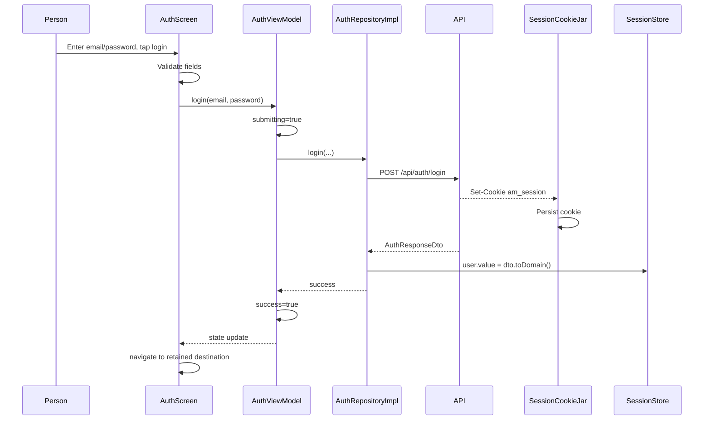

# Walkthrough: Authentication and Protected Routes

## Prerequisites

- [API, JSON, and Authentication](../02-domain/api-json-auth.md)
- [App Startup and Navigation](app-startup-and-navigation.md)
- [Networking and Serialization](../04-frameworks/networking-and-serialization.md)

## The Three Pieces of Session State

1. Server-side session associated with the cookie.
2. Persisted `am_session` cookie in DataStore.
3. Current `User?` in `SessionStore.user`.

The cookie lets the server recognize the client. The user object lets the UI display account state and guard navigation.

## Login Flow



## Form Validation

`AuthScreen` keeps text and an `attempted` flag locally. Before the first submit, it avoids showing errors. After submit, invalid fields show supporting text.

Registration additionally validates display name. Text input is truncated to API maximum lengths during editing.

Client validation is for fast feedback. The server still validates and may return API errors.

## Duplicate Submission Guard

`AuthViewModel.submit` returns early if already submitting. The button is also disabled during submission. Together they reduce accidental repeated login/register requests.

## Error Distinctions

Wrong password:

1. server returns code `INVALID_CREDENTIALS`;
2. `mapApiFailure` preserves it as `AppFailure.Api`;
3. `toUiError` maps it to `UiError.InvalidCredentials`;
4. `ErrorState` displays a specific localized prompt.

Expired session:

1. protected call returns `UNAUTHORIZED`;
2. repository clears cookie and current user;
3. UI sees signed-out state;
4. prompt says session expired where the error is displayed.

These two cases may share HTTP status `401`, but API error codes keep their business meanings distinct.

## Registration

Registration shares `AuthScreen` and `AuthViewModel` with login. A `register` Boolean controls visible display-name field, button labels, validation, and repository action.

The backend returns the new user and cookie, so registration also establishes a session.

## Session Restoration

At startup, `AppViewModel` calls `AuthRepository.restoreSession`.

- saved valid cookie → `/api/auth/me` returns user;
- no/expired/invalid cookie → unauthorized, clear cookie, remain signed out;
- other failure → startup continues after `runCatching`.

This design prioritizes entering the public gallery even if session restoration cannot reach the network.

## Protected Routes

Upload, My Museum, and Edit require `state.user != null`.

Navigation retains intended destination in route text:

```text
login/upload
login/mine
```

After success, login is removed and intended destination is opened.

The server separately verifies the cookie and ownership for protected API operations.

## Unauthorized During a Protected Operation

`GalleryRepositoryImpl.authenticated` wraps personal gallery and mutations. If it catches `AppFailure.Unauthorized`, it:

1. clears cookie;
2. sets current user to null;
3. rethrows the failure.

The active operation shows the error, and top-level state now reflects sign-out.

## Logout

Logout tries to notify the server but intentionally ignores failure:

```kotlin
runCatching { apiCallUnit(...) }
cookieJar.clear()
sessionStore.user.value = null
```

Business reason: a user must be able to remove local session state even if the server cannot be reached.

## Relevant Tests

- ViewModel test verifies login publishes success.
- ViewModel test verifies invalid credentials become a specific UI error.
- UI test verifies English wrong-password prompt.
- connected test verifies signed-out Upload navigation reaches authentication.
- live contract verifies unauthorized `/api/auth/me` JSON and cookie scheme.

## Security Boundaries

The client improves UX but cannot enforce security by itself. Never assume a hidden button protects a route. The server must authenticate every protected call and authorize ownership-sensitive mutations.
