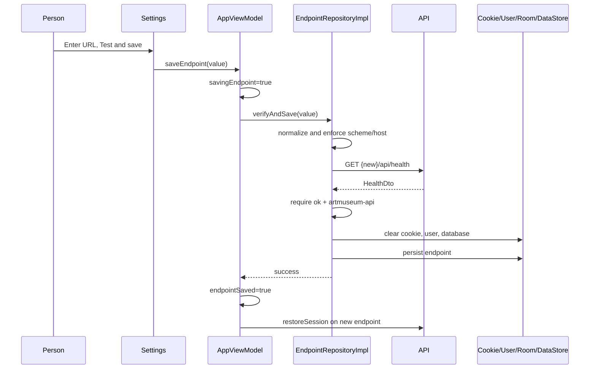
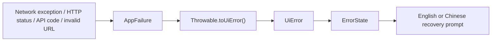

# Walkthrough: Endpoint Changes and Error Prompts

## Prerequisites

- [API, JSON, and Authentication](../02-domain/api-json-auth.md)
- [Networking and Serialization](../04-frameworks/networking-and-serialization.md)
- [Persistence, Cache, and Images](../04-frameworks/persistence-cache-images.md)

## Why Endpoint Replacement Is Sensitive

An endpoint identifies an entire server deployment. Accounts, cookies, and cached artwork from one deployment must not silently appear under another.

The app therefore tests compatibility before saving and clears server-specific local state only after a successful change.

## Endpoint Save Trace

## URL Normalization Rules

`normalizeEndpoint`:

- trims surrounding whitespace;
- removes trailing `/`;
- parses a `URI`;
- requires a host;
- requires HTTPS;
- permits debug-only HTTP for localhost, `127.0.0.1`, or `10.0.2.2`.

These checks happen before the health request.

Release Android network security separately denies cleartext HTTP. Debug Android configuration separately allows only local hosts. The duplicated policy reduces accidental gaps.

## Compatibility Check

The server must respond to `/api/health` with `ok = true` and `service = "artmuseum-api"`. A reachable unrelated server is not accepted.

Only a different normalized endpoint causes local clearing and persistence. Re-saving the current endpoint does not destroy state.

## Error Pipeline

Every user-facing operation follows a layered error pipeline:

## Why Typed Errors Matter

Compare:

- wrong password → “Email or password is incorrect”;
- expired session → “Your session has expired. Log in to continue”;
- unreachable API → “Check your connection or API endpoint”;
- invalid endpoint syntax → “Enter a valid Art Museum API address.”

A generic “Something went wrong” would hide the action the user can take.

## Layers and Their Responsibilities

### Data Layer

`ApiSupport.kt` turns exceptions, error JSON, and status codes into `AppFailure`.

### Presentation Logic

`Throwable.toUiError()` converts failures into a closed set of UI categories. It avoids letting screens understand HTTP or exception classes.

### UI and Localization

`ErrorState` chooses the localized recovery prompt and optional retry button.

## Retry Behavior

`ErrorState` accepts an optional callback. Gallery and detail provide retry functions. Form submission errors generally do not automatically retry because the user may need to correct input.

## Expected Error Categories

- Offline: no usable connection.
- Timeout: request exceeded time limit.
- Unreachable: DNS/routing/connection failure.
- Server unavailable: 5xx category.
- Invalid response: missing body or incompatible JSON.
- Rate limited: too many requests.
- Invalid credentials / duplicate email: authentication-specific actions.
- Unauthorized / forbidden / not found: access/resource state.
- Invalid request / upload-specific failures: correct fields or file.
- Invalid endpoint: correct server address.
- Generic: final fallback for unknown cases.

## Relevant Tests

- `ApiSupportTest` verifies network/status/API-code categories.
- `ViewModelsTest` verifies failure-to-UI mapping.
- `ErrorPromptTest` verifies visible English and Chinese prompts.
- `SettingsScreenshotTest` verifies settings visual regression.
- live contract test validates production error JSON.

## Adding a New Prompt

1. Confirm the backend exposes a stable error code or failure category.
2. Preserve it in `mapApiFailure`.
3. add a corresponding `UiError`;
4. map it in `toUiError`;
5. add English and Chinese `AppStrings` fields;
6. render it in `ErrorState`;
7. test mapping and visible prompt.

This cross-layer change is a good example for [Extension Guide](../07-extension/extension-guide.md).
