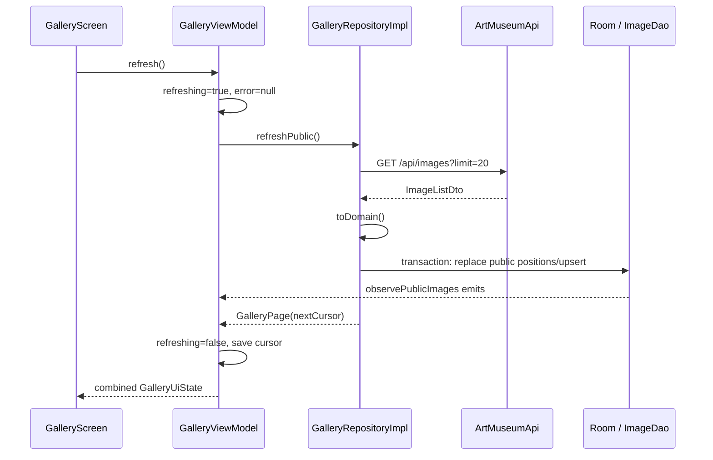

# Walkthrough: Gallery, Pagination, and Offline Detail

## Prerequisites

- [Asynchronous and Reactive Programming](../01-foundations/async-and-reactive.md)
- [Architecture and Data Flow](../03-architecture/architecture-and-data-flow.md)
- [Persistence, Cache, and Images](../04-frameworks/persistence-cache-images.md)

## Public Gallery Refresh

This path begins when `GalleryViewModel` is created or the person pulls to refresh.



## Why the Response Is Written Before Rendering

The network response is not directly assigned to `GalleryUiState.images`. Instead, the repository writes Room, and the observed Room query supplies images.

Benefits:

- one path for online and cached content;
- cache updates automatically update UI;
- refresh failure does not erase cached content;
- database ordering rules remain centralized.

## Cache Merge Logic

Refresh clears only `publicPosition`, not entire rows. For every downloaded item it preserves existing `minePosition` and writes a fresh public position.

The transaction prevents observers from seeing the list between clear and repopulation.

## UI Branches

`GalleryScreen` deliberately distinguishes:

- empty + refreshing → full loading;
- empty + error → full error with retry;
- empty + no error → empty museum message;
- images present → grid, possibly with footer error or pagination loader.

Notice that images plus error still renders images. This is the visible result of offline cache resilience.

## Image Rendering

Each `MuseumImageCard`:

- uses stable artwork ID as list key;
- loads `image.url` through Coil;
- chooses alt text or title for content description;
- derives aspect ratio from dimensions;
- displays title and owner;
- invokes `onImage(image.id)` when tapped.

## Cursor Pagination

The grid monitors scroll position inside `LaunchedEffect`.

1. `snapshotFlow` observes the last visible item index.
2. When within three items of the end and cursor exists, it emits `true`.
3. `distinctUntilChanged` prevents repeated adjacent `true`.
4. `filter { it }` ignores `false`.
5. collection calls `viewModel.loadMore()`.

The ViewModel guards:

- no cursor → return;
- already loading → return.

The repository URL-encodes the cursor, requests the next page, calculates the existing list size, then appends positions.

## End of Pagination

The server returns `nextCursor = null`. ViewModel stores it. Later scroll checks cannot trigger another request because the condition requires a non-null cursor.

## Artwork Detail: Online Path

Tapping a card navigates to `detail/{id}`. `DetailViewModel` reads `id` from `SavedStateHandle` and calls `repository.getImage(id)`.

On success:

1. fetch full detail from `/api/images/{id}`;
2. preserve cached public/personal positions;
3. upsert fresh metadata;
4. publish image with `loading = false`;
5. render full image, title, owner, description, dimensions, format, and size.

## Artwork Detail: Offline Path

If `apiCall` throws an `AppFailure.Network`, `getImage` reads Room:

```kotlin
dao.get(id)?.toDomain() ?: throw failure
```

If cache contains the work, detail still renders. If not, the original network failure reaches the ViewModel and UI.

Server `NotFound` does not fall back. That result means the server explicitly says the resource no longer exists.

## Relevant Tests

`ViewModelsTest.galleryKeepsCachedImagesWhenRefreshIsOffline` proves the ViewModel preserves emitted cache content while publishing an offline error.

`galleryGuardsLoadMoreWithoutCursor` proves pagination does not request a page without a cursor.

The live contract test proves current gallery and image JSON deserialize with production DTO serializers.

## Safe Extension Ideas

- Add a manual refresh action by calling existing `viewModel.refresh`.
- Add a detail metadata field by updating DTO, domain model, entity, mappings, and detail screen.
- Add a visible end-of-list indicator based on `nextCursor == null` after initial load.

For the full change checklist, read [Extension Guide](../07-extension/extension-guide.md).
