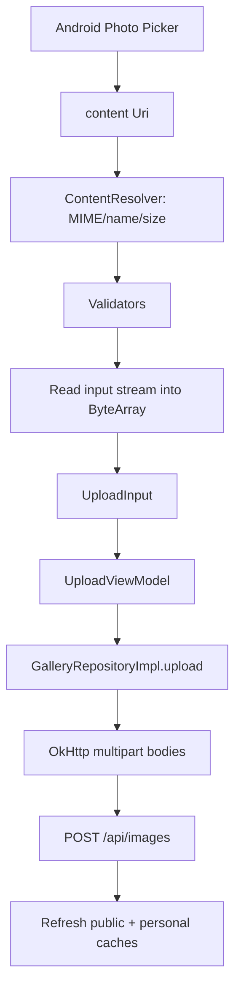

# Walkthrough: Upload, Edit, and Delete

## Prerequisites

- [Art Museum Domain](../02-domain/art-museum-domain.md)
- [API, JSON, and Authentication](../02-domain/api-json-auth.md)
- [Persistence, Cache, and Images](../04-frameworks/persistence-cache-images.md)
- [Authentication and Protected Routes](authentication.md)

## Upload Overview

Uploading crosses Android’s Photo Picker, local validation, byte reading, multipart HTTP, authentication, and cache refresh.

## Photo Picker

`rememberLauncherForActivityResult(ActivityResultContracts.PickVisualMedia())` registers a system-mediated action. The app requests image-only visual media.

The callback receives a nullable `Uri`. A URI identifies selected content without requiring raw filesystem access.

## Preview

Once selected, `AsyncImage(model = uri)` previews local content. Coil supports both remote URLs and Android content URIs.

## Validation and Reading

On upload tap:

1. get MIME type from `ContentResolver`;
2. query optional display name and size;
3. reject missing image or title;
4. reject unsupported MIME type;
5. reject metadata size over 10 MiB;
6. read bytes from input stream;
7. validate actual byte count and MIME type;
8. construct `UploadInput`.

The second size check matters because provider metadata can be missing or inaccurate.

Potential memory consideration: `readBytes()` loads the entire image into memory. The 10 MiB cap bounds that cost. A larger-file app would stream content instead.

## Multipart Construction

Repository code:

1. turns bytes into `RequestBody` with image media type;
2. creates named form-data part `file`;
3. creates plain-text request bodies;
4. calls Retrofit upload;
5. converts returned DTO to domain model.

The operation is wrapped by `authenticated`, so unauthorized response clears local session state.

## Post-Upload Refresh

After successful upload, the repository refreshes both public and personal lists. That updates Room and causes observers to emit.

Then `UploadViewModel` publishes `success = true`. `UploadScreen` observes success and navigates to My Museum, removing Upload from the back stack.

## Personal Museum

`MineViewModel` refreshes `/api/images/mine`. The repository clears personal positions, preserves public positions, and upserts owned items.

`MineScreen` uses a list of `MuseumImageCard`; tapping one navigates to edit rather than public detail.

## Edit

`EditViewModel` reads artwork ID from `SavedStateHandle` and loads detail. The screen copies loaded fields into local form state inside `LaunchedEffect(state.image?.id)`.

On Save:

1. screen validates title, description, and alt text;
2. ViewModel creates `ImageUpdate`;
3. repository creates `ImageUpdateDto`;
4. API receives `PATCH /api/images/{id}`;
5. repository preserves cached positions and upserts returned metadata;
6. ViewModel marks `saved = true`.

The current screen remains visible after save.

## Delete

Delete requires confirmation through `AlertDialog`.

On confirmation:

1. ViewModel calls repository delete;
2. repository sends authenticated `DELETE`;
3. successful response removes Room row;
4. Room observers remove the work from all cached lists;
5. ViewModel sets `deleted = true`;
6. screen navigates up.

Deleting the entire row is correct because the server says the artwork itself no longer exists.

## Authorization Failures

If another user’s work is somehow opened for edit, the server should return forbidden. That maps to a prompt explaining the user lacks permission. App navigation is not treated as the authorization boundary.

## Important Edge Cases

- Picker cancellation leaves URI null.
- Provider may omit file name or size.
- Input stream may fail or return no bytes.
- Server may reject a file even after client validation.
- Session may expire during upload/edit/delete.
- Storage service may fail independently of the ArtMuseum API.
- Refresh after upload may fail after the upload itself succeeded; current implementation would report upload failure because refresh is inside the repository operation.

The last behavior is an architectural trade-off worth revisiting if upload acknowledgment must be distinguished from post-upload refresh.

## Testing Opportunities

Existing validators cover size/type boundaries. High-value future tests include:

- ViewModel duplicate upload guard;
- repository multipart field construction;
- unauthorized mutation clears session;
- successful delete removes cached row;
- edit preserves both list positions.

See [Testing and Continuous Integration](../06-quality/testing-and-ci.md) before adding them.
