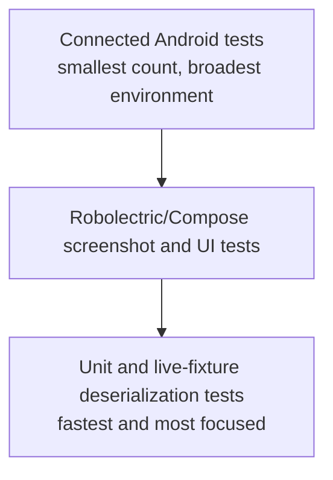

# Testing and Continuous Integration

## Prerequisites

- [Dependencies and Build System](../reference/dependencies-and-build.md)
- [Architecture and Data Flow](../03-architecture/architecture-and-data-flow.md)
- [API, JSON, and Authentication](../02-domain/api-json-auth.md)

## Why Tests Exist

A test is executable evidence that a behavior still works. Good tests focus on meaningful outcomes, boundaries, branches, and failures rather than mirroring implementation details.

The project’s `constraints.md` explicitly prioritizes externally observable behavior, branching logic, state machines, boundary conditions, and errors.

## Test Pyramid in This Repository



Different tests answer different questions. One green layer does not prove all other layers.

## Local Unit Tests

Location: `app/src/test`.

They run on the development JVM with JUnit 4.

### Validator Tests

`ValidatorsTest` checks boundaries: shortest valid password, maximum title, one byte, exactly 10 MiB, and invalid MIME types.

Boundary testing is valuable because off-by-one mistakes often occur at minimum/maximum values.

### API Support Tests

`ApiSupportTest` verifies mapping behavior:

- invalid credentials stay distinct from expired session;
- stable API codes remain available;
- status-only errors become actionable categories;
- network exception classes become network categories.

### ViewModel Tests

`ViewModelsTest` uses hand-written fake repositories. It verifies observable state behavior without real network/database:

- cached images remain on offline refresh;
- pagination is guarded without cursor;
- login success is published;
- invalid credentials become the right UI error.

`MainDispatcherRule` replaces `Dispatchers.Main` with a test dispatcher and restores it afterward. `runTest` provides controlled coroutine execution; `advanceUntilIdle` runs scheduled work until no tasks remain.

## Robolectric and Compose UI Tests

Robolectric simulates enough Android framework behavior to run Android-oriented tests on the local JVM.

`ErrorPromptTest` renders `ErrorState` under specific language providers and asserts visible text.

`SettingsScreenshotTest` renders Settings and captures it with Roborazzi. `verifyRoborazziDebug` compares current output against the tracked baseline PNG.

Screenshot tests detect broad visual changes, but intentional UI changes require consciously updating baselines.

## Connected Android Tests

Location: `app/src/androidTest`.

These install and run on an emulator or device.

- `AppContextTest` verifies published package identity.
- `MainActivityTest` launches the real activity and verifies protected Upload navigation reaches login.

Connected tests are slower but cover real Android integration that local tests may not reproduce.

## Live JSON Contract Tests

`scripts/run-live-contract-tests.ps1` performs non-mutating production checks:

1. download JSON fixtures with `curl.exe`;
2. assert expected HTTP statuses;
3. parse each as JSON in PowerShell;
4. choose the first public image for detail;
5. set `ARTMUSEUM_CONTRACT_FIXTURE_DIR`;
6. run only `LiveContractDeserializationTest`;
7. clear the environment variable.

The Kotlin test:

- deserializes fixtures with production serializers;
- checks health identity, gallery content/cursor, detail identity, unauthorized error;
- parses OpenAPI and checks required routes and cookie auth.

Ordinary unit runs skip these tests through JUnit `assumeTrue` when fixtures are absent. This avoids silently depending on network availability.

## Continuous Integration

`.github/workflows/android-ci.yml` runs on pushes and pull requests to `main`, plus manual dispatch.

### Build Job

Windows runner:

- unit tests;
- Roborazzi verification;
- lint;
- debug APK assembly;
- uploads lint report and APK.

### Live Contract Job

Windows runner executes the PowerShell contract script against production.

### Connected Tests Job

Ubuntu runner enables KVM, starts an API 36 emulator, and runs connected Android tests after the build job succeeds.

Concurrency cancels older in-progress runs for the same ref.

## Running Tests Locally

```powershell
.\scripts\run-live-contract-tests.ps1
.\gradlew.bat testDebugUnitTest verifyRoborazziDebug lintDebug assembleDebug connectedDebugAndroidTest
```

The connected task requires a running emulator/device.

## Choosing a Test for a Change

| Change | Best first test |
| --- | --- |
| Validation boundary | Unit test |
| Error mapping | Unit test |
| ViewModel state transition | ViewModel test with fake repository |
| Localized visible prompt | Compose/Robolectric UI test |
| Layout appearance | Roborazzi screenshot |
| Navigation/Android integration | Connected test |
| DTO/API contract | Live fixture deserialization test |
| DAO query/transaction behavior | Room integration test, currently a gap |

## Known Coverage Gaps

The existing suite does not deeply verify:

- repository/Room cache merge operations;
- cookie persistence and matching;
- endpoint replacement clearing behavior;
- multipart upload construction;
- edit/delete repository behavior;
- many navigation routes and Chinese layouts.

These are opportunities, not proof that behavior is wrong. Add tests when modifying those risk areas.

## Testing Principle

Prefer tests that survive refactoring. Assert “cached images remain visible after offline refresh,” not “method X calls method Y exactly once,” unless that interaction is itself the contract.
