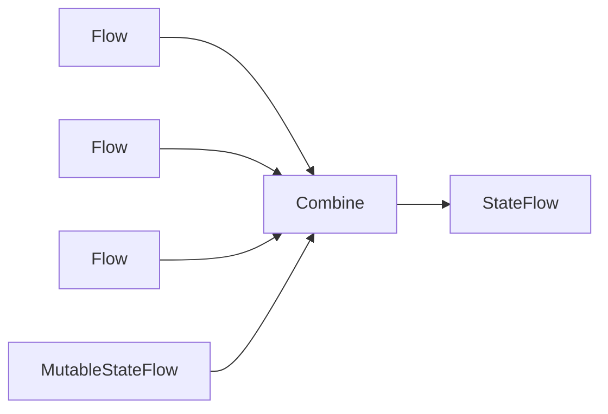

# Advanced Internals

## Prerequisites

This is the final deep-dive lesson. Read:

- [Architecture and Data Flow](../03-architecture/architecture-and-data-flow.md)
- [Asynchronous and Reactive Programming](../01-foundations/async-and-reactive.md)
- all [real execution walkthroughs](../README.md#stage-5-real-execution-and-code-walkthroughs)

## Purpose

This lesson examines subtle behavior that emerges from timing, object lifetime, cache semantics, and framework boundaries. These details are important when diagnosing rare bugs or evolving the design.

## Top-Level State Is a Projection

`AppViewModel.state` is not stored as one mutable object. It is a projection combining:

- current user from `SessionStore`;
- endpoint from DataStore;
- language from DataStore;
- transient operation flags from `operationState`.



The combine lambda copies operation state and overwrites the three externally owned fields. Therefore, writing `user`, `endpoint`, or `language` into `operationState` would not control the final state.

This ownership model is useful but implicit. When adding a state field, decide which source owns it.

## Subscription-Driven State

`stateIn(..., SharingStarted.WhileSubscribed(5_000), initial)` collects upstream flows only while consumers exist, with a five-second grace period.

Implications:

- UI collection activates Room/DataStore observation;
- short configuration/navigation gaps do not immediately stop upstream collection;
- reading `.value` without ever collecting may leave the initial value longer than expected in tests;
- tests explicitly start background collection before asserting combined state.

## Repository Operation State Can Race

ViewModel actions launch independent coroutines. Guards reduce duplicate requests, but not every operation is serialized.

For example, multiple `refresh()` calls can overlap because Gallery refresh has no `refreshing` early-return guard. A slower earlier request could complete after a newer request and overwrite cursor state. Room contents also follow transaction completion order.

Possible future approaches:

- guard refresh while active;
- cancel previous refresh job;
- attach request generation IDs and ignore stale completion;
- serialize mutations through a mutex.

Choose based on observed product requirements rather than adding complexity preemptively.

## Cookie and Endpoint Coupling

The persisted cookie is parsed using the persisted endpoint at `SessionCookieJar` construction. Endpoint changes clear the cookie before saving the new endpoint, preserving domain correctness.

Because OkHttp `CookieJar` methods are synchronous while DataStore is asynchronous, `runBlocking` bridges them. This can block the calling thread during persistence. The in-memory cookie minimizes reads after construction, but writes still block.

A more advanced adapter could:

- keep memory state authoritative during process life;
- launch persistence asynchronously;
- preload persisted cookie before building OkHttp;
- use encrypted persistence if the threat model requires it.

Each alternative changes startup ordering and failure behavior.

## Cache Membership Invariants

Expected invariants:

- `id` uniquely identifies an artwork row;
- public query contains rows with non-null `publicPosition`;
- personal query contains rows with non-null `minePosition`;
- positions define display order;
- refreshing one list preserves the other list’s position;
- deletion removes the artwork from every list.

Current design does not enforce unique position values at the database schema level. Correctness relies on repository write logic. Overlapping/racing refreshes could produce surprising ordering even though each transaction is internally atomic.

Room integration tests would provide stronger evidence for these invariants.

## Network Truth Versus Cache Truth

Different operations choose authority differently:

- gallery list UI: Room is immediate observable source;
- next cursor: latest successful network page stored in ViewModel;
- detail: network preferred, cache only on network failure;
- mutation: network must succeed, then cache updates;
- current user: server restored into memory;
- endpoint/language: DataStore is persistent source.

There is no single universal source of truth. Each value needs an explicit authority and freshness policy.

## Upload’s Compound Success Semantics

`upload` performs:

1. server upload;
2. public refresh;
3. personal refresh;
4. return image.

If step 1 succeeds and step 2 fails, the method throws and the UI reports failure even though the artwork may exist on the server. Retrying could upload a duplicate.

Possible redesign:

- return success immediately after upload and refresh best-effort;
- use returned image to update both relevant cache memberships;
- distinguish `UploadedButRefreshFailed` state;
- make backend support idempotency keys.

This is a good example of why “success” must be defined at the business level.

## Restoration Failure Semantics

Startup uses `runCatching { restoreSession() }` without exposing non-unauthorized errors. This allows public browsing startup to continue during network failure, but the UI does not tell the user that account restoration was uncertain.

Potential alternatives:

- show a non-blocking restoration warning;
- keep a separate unknown/authenticated/signed-out session state;
- retry restoration when connectivity returns.

The current nullable `User` collapses “definitely signed out” and “could not verify session” after non-unauthorized failure.

## Navigation and Encoding

Route arguments are interpolated directly:

```text
detail/{id}
login/{destination}
```

Current IDs and destinations are expected to be route-safe. If future arguments can contain `/`, `?`, `%`, or arbitrary user text, they must be URI-encoded or passed using a safer typed/navigation strategy.

## Process Death Versus Configuration Change

ViewModels survive ordinary configuration changes but not process death. Persistent data survives:

- Room cache;
- DataStore preferences/cookie;
- Navigation may restore some back-stack state.

In-memory `SessionStore.user` is lost and reconstructed through `/api/auth/me`. Local form fields using `remember` may be lost across activity recreation or process death; `rememberSaveable` or `SavedStateHandle` would be needed for stronger restoration.

## Release Security and Debug Convenience

The network policy is split across:

- repository URL validation;
- main release-oriented network XML;
- debug manifest override;
- debug network XML.

This layered setup is intentional. A change to local-development support must be checked in every layer to avoid either blocking valid debug work or accidentally allowing release cleartext traffic.

## Advanced Review Checklist

When reviewing a complex change, ask:

- Who owns each state field?
- Can two coroutines update it out of order?
- What survives recomposition, configuration change, and process death?
- Which source is authoritative during failure?
- Are compound operations partially successful?
- Does cache membership remain valid after every path?
- Does endpoint/account isolation still hold?
- Are route and URL values safely encoded?
- Does the test suite prove invariants, not only happy paths?

## Next

Apply these questions while using [Extension Guide](extension-guide.md) and [Design Decisions and Alternatives](design-decisions.md). They are the bridge from understanding the repository to evolving it responsibly.
