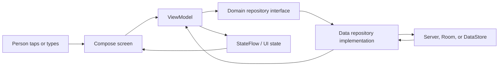

# Learn the Art Museum Android App

This directory is a course for understanding and changing this repository. It assumes you may be new to programming, Kotlin, Android, web APIs, databases, and software architecture.

The lessons are ordered by knowledge dependency. Read them in order on your first pass. Each later lesson links back to the ideas it expects you to know.

## What You Will Learn

By the end, you should be able to:

- explain what the Art Museum app does and how it cooperates with the backend service;
- read the Kotlin syntax used throughout the project;
- follow an event from a button tap to the server or database and back to the screen;
- understand why the project separates domain, data, dependency injection, and presentation code;
- debug network, authentication, cache, UI-state, and build failures;
- add a feature without breaking the existing architectural boundaries.

## Learning Roadmap

### Stage 0: Orientation

1. [Repository Tour](00-orientation/repository-tour.md) explains the product, the directory tree, and the shortest path through the code.
2. [Glossary](reference/glossary.md) is the shared vocabulary for every lesson.

### Stage 1: Prerequisite Knowledge

3. [Programming, Web, and Android Foundations](01-foundations/programming-web-android.md) introduces clients, servers, HTTP, JSON, processes, Android apps, and local storage.
4. [Kotlin From Zero](01-foundations/kotlin-from-zero.md) teaches the Kotlin language and syntax used here.
5. [Asynchronous and Reactive Programming](01-foundations/async-and-reactive.md) explains coroutines, `suspend`, `Flow`, `StateFlow`, and observable state.

### Stage 2: Product and Domain

6. [Art Museum Domain](02-domain/art-museum-domain.md) explains artwork, galleries, ownership, accounts, uploads, pagination, and offline browsing.
7. [API, JSON, and Authentication](02-domain/api-json-auth.md) explains the backend contract, HTTP methods, status codes, cookies, DTOs, and multipart uploads.

### Stage 3: Architecture

8. [Architecture and Data Flow](03-architecture/architecture-and-data-flow.md) introduces Clean Architecture, SOLID, layers, and dependency direction.
9. [Packages and Responsibilities](03-architecture/package-map.md) maps every important source file to its job.
10. [Dependency Injection with Hilt](03-architecture/dependency-injection.md) explains how the app constructs and connects objects.

### Stage 4: Android Frameworks and Libraries

11. [Compose, State, and Navigation](04-frameworks/compose-state-navigation.md) explains the UI model and route graph.
12. [Networking and Serialization](04-frameworks/networking-and-serialization.md) covers Retrofit, OkHttp, kotlinx serialization, failures, and absolute URLs.
13. [Persistence, Cache, and Images](04-frameworks/persistence-cache-images.md) covers Room, DataStore, cache merging, transactions, and Coil.
14. [Dependencies and Build System](reference/dependencies-and-build.md) explains Gradle, plugins, source sets, and every important dependency family.

### Stage 5: Real Execution and Code Walkthroughs

15. [App Startup and Navigation](05-walkthroughs/app-startup-and-navigation.md)
16. [Gallery Refresh, Pagination, and Offline Detail](05-walkthroughs/gallery-and-offline.md)
17. [Login, Session Restoration, and Protected Routes](05-walkthroughs/authentication.md)
18. [Upload, Edit, and Delete](05-walkthroughs/upload-edit-delete.md)
19. [Endpoint Changes and Error Prompts](05-walkthroughs/endpoint-and-errors.md)

### Stage 6: Quality and Maintenance

20. [Testing and Continuous Integration](06-quality/testing-and-ci.md)
21. [Debugging Guide](06-quality/debugging.md)
22. [Extension Guide](07-extension/extension-guide.md)
23. [Design Decisions and Alternatives](07-extension/design-decisions.md)
24. [Advanced Internals](07-extension/advanced-internals.md)

### Reference

- [Kotlin Syntax Cookbook](reference/kotlin-syntax-cookbook.md)
- [Code Map](reference/code-map.md)
- [Glossary](reference/glossary.md)

## Recommended Ways to Study

For a complete beginner, read the roadmap in order and run the app after Stage 1. When a term is unfamiliar, follow its glossary or prerequisite link before continuing.

For a developer new to this repository, read the repository tour, architecture, package map, then the five execution walkthroughs.

For a specific task, start with the relevant walkthrough and then use the extension and debugging guides.

## The Central Mental Model

Most behavior in this app follows this loop:

The rest of this course teaches what each box means, why it exists, and where it is implemented.
